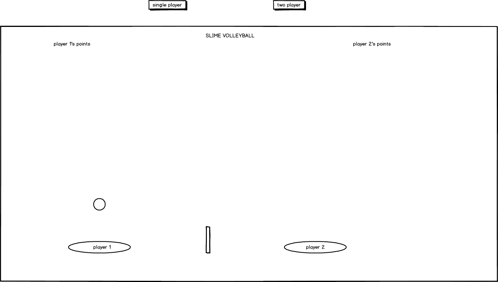

# Slime Volleyball

## Background

Slime volleyball is a simple browser game where players control a slime to hit a ball across a net.  When the ball lands on your side of the court, your opponent gets a point.  The winner of a match is the first player to get 7 points.

## Functionality and MVP

My version of slime volleyball will have the following:

* controlling the slimes using a keyboard
* ball bouncing physics
* starting a new game
* Single player vs AI
* Two player using wasd and arrow keys
* production readme

## Wireframes

This app will have a single page where the player will first choose between 1 or 2 players.  The current score will be displayed on the top of the court and the controls will be on the bottom.  

## Technologies and Architecture

This project will be implemented with the following:

* JavaScript and jquery for game logic
* Easel.js with HTML5 Canvas for rendering
* Webpack to bundle and server the scripts

The entry file will be slime.js which will tie in all of the other parts and set up the game.  There will be a player.js file that will have all of the scripting logic necessary for the human player to be shown and be able to control their slime.  Ball.js will have the ball physics logic.  Cout.js will have the rendering logic and keep track of the current score and who the two players are (human or AI).  

## Implementation Timeline  

Day 1:
* Create the basic setup and file structure necessary for the project.
* Learn the basics of Easel

Day 2:
* Continue to learn Easel
* Create the court and players and have proper rendering
* Implement the keyboard controls for the players

Day 3:
* Implement the ball physics.
* Finish everything needed for a two player game

day 4:
* Implement AI
* Allow the choice between single or two player

## Bonus Features

* sound effects
* add slime soccer as an option
