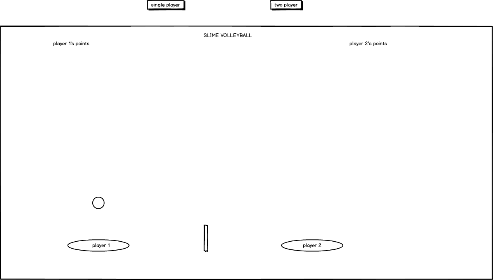

# Slime Volleyball

## Background

Slime volleyball is a simple browser game where players control a slime to hit a ball across a net.  When the ball lands on your side of the court, your opponent gets a point.  The winner of a match is the first player to get 7 points.

## Functionality and MVP

My version of slime volleyball will have the following:

* controlling the slimes using a keyboard
* ball bouncing physics
* tracking score and starting a new game
* Single player vs AI
* Two player using wasd and arrow keys
* production readme

## Wireframes

This app will have a single page where the player will first choose between 1 or 2 players.  The current score will be displayed on the top of the court and the controls will be on the bottom.  

## Technologies

This project will be implemented with the following:

* JavaScript and jquery for game logic
* Easel.js with HTML5 Canvas for rendering
* Webpack to bundle and server the scripts

## Implementation Timeline  

Day 1:
* Create the basic setup and file structure necessary for the project.
* Learn the basics of Easel

Day 2:
* Continue to learn Easel
* Create the court and players and have proper rendering
* Implement the keyboard controls for the players

Day 3:
* Implement the ball physics.
* Finish everything needed for a two player game

day 4:
* Implement AI
* Allow the choice between single or two player

## Bonus Features

* sound effects
* add slime soccer as an option
